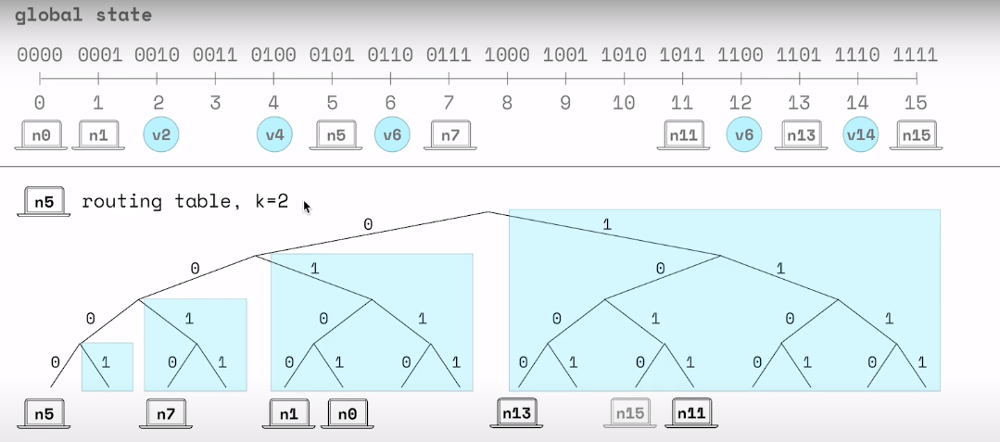
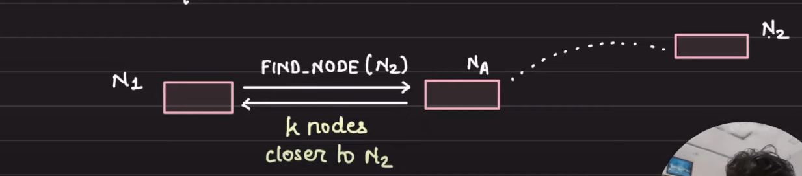
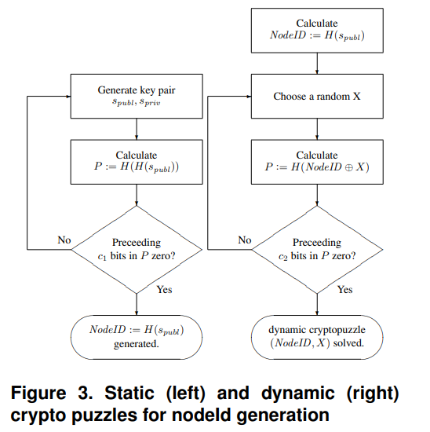

- NOTE: This s/kademlia implementation was partially inspired on the kademlia implementation of [JohnsuaKissoon](https://github.com/JoshuaKissoon/Kademlia) as it is a very organized and well put together project.

# Table of Contents

- [Table of Contents](#table-of-contents)
- [Starting a Node](#starting-a-node)
- [Kademlia](#kademlia)
  - [Elements of a Node](#elements-of-a-node)
  - [Distance between nodes](#distance-between-nodes)
  - [Routing Strategy](#routing-strategy)
    - [Updating routing table](#updating-routing-table)
  - [Communication Interface](#communication-interface)
- [S/Kademlia](#skademlia)
  - [Main Improvements](#main-improvements)
  - [Signatures types using GUID:](#signatures-types-using-guid)
  - [Preventing Sybil attacks](#preventing-sybil-attacks)
    - [Types of Crypto puzzles](#types-of-crypto-puzzles)
  - [Reliable Sibling Broadcast](#reliable-sibling-broadcast)
  - [Routing Table](#routing-table)
    - [Adding addresses](#adding-addresses)
  - [Parallel Lookup Protocol](#parallel-lookup-protocol)
  - [Joining the network (Bootstrap)](#joining-the-network-bootstrap)
- [Footnotes](#footnotes)
- [Questions](#questions)

# Starting a Node

```bash
mvn exec:java -D"exec.mainClass"="ds.assignment.tokenring.TokenService" -D"exec.args"="{host_name} {port}"
```

- host_name: Access point name (e.g. an ipv4 address).
- port: Access point port.

# Kademlia

- Distributed Hash Table (DHT) used for decentrilized P2P networks

## Elements of a Node

- GUID (Unique Node ID)
  
  - **Implicitly derived** (P2P network)
  
  - explicitly assigned (Tracker)

- Address of node (IP, port)

- Routing Table 

- API to call other nodes

## Distance between nodes

- Distance between nodes are calculated using the XOR of the GUIDs. The XOR works by **setting the bits which are set in either of one of the given numbers (0 ^ 1 = 1, 1 ^ 0 = 1) and finally taking out the common bits present in both numbers (1 ^ 1 = 0)**.

- XOR properties:
  
  - d(x,x) = 0
  
  - d(x,y) > 0, if x != y
  
  - ∀ x,y : d(x,y) = d(y,x) -- symmetry
  
  - d(x,z) <= d(x,y) + d(y,z) -- triangle inequality

## Routing Strategy

<mark>Global state to emerge from local knowledge.</mark>

- If each node keeps track of other n **random nodes** then they would not **converge**.

- Every node for each **sub-tree** knows **k-buckets** (usually its k=20)

- Each bucket is sorted by the last time seen (most recent at the tail)

<p>
    
</p>
<p>
    <em>n15 was a node that was discarded out of the bucket for a more recent node</em>
</p>

<u>Note: Buckets are determined  by the distance they are away from a certain node.</u> n7 is part of the 1<sup>st</sup> bucket (branch 1 and 2 are merged since they are small) because $n5 \oplus n7 <= 011_2$. 

$n11$ is part of the 3<sup>rd</sup> (4-1) bucket  because $n5 \oplus n11 <= 01111_2 = 2^4-1$ .

$nx$ <u>will be part of the</u> (n-1)<sup>th</sup> <u>bucket since</u> $n5 \oplus nx <= 2^n - 1$

### Updating routing table

1. when a node receives any message from a different node, it updates its **appropriate k-bucket** with the node id (adds it at the tail).
2. If the **k-bucket** is full
   1. node pings the **least-recently seen node** (at the head).
   2. If there is no response, then **remove it from the bucket** and **insert a new node** at the tail.
   3. If there is a response, then **new node is discarded** and the **first node is moved to the tail** [(1.)](#footnotes).

## Communication Interface

Every node exposes 4 RPC: 

- **PING**: Probes a node to see if it's online.

- **FIND_NODE**: The node returns <IP, port, node id> for the k buckets it knows that are closer to the requested node.



- **FIND_VALUE:** Returns the value of a given key.
- **STORE**: Instruct a node to store <k,v> pair.

# S/Kademlia

## Main Improvements

1. In order to limit the number of nodes controlled by an attacker, add a PoW (proof of work) to node ID creation
2. Add a parallel lookup protocol: Each lookup is performed in parallel through d (e.g. d=8) disjoint channels. As long as one of them only goes through honest nodes, the lookup is successful
3. Add a sibling broadcast list, a list of η⋅s nearest node maintainted by each node
- **GUID** = hash over public key (for authentication purposes). hash over IP is not feasable nor pratical.

## Signatures types using GUID:

- **Weak Signature**: The weak signature does not sign the whole message. It is limited to IP address, port and a timestamp. The timestamp specifies how long the signature is valid. This prevents replay attacks if dynamic IP addresses are used. For synchronization issues the timestamp may be chosen in a very coarse-grained way. The weak signature is primarily used in **FIND NODE** and **PING** messages where the integrity of the whole message is dispensable

- **Strong signature**: The strong signature signs the full content of a message. This ensures integrity of the message and resilience against Man-in-the-Middle attacks. Replay attacks can be prevented with nonces inside the RPC messages.

These 2 types of signature ensure **authentication** and **integrity**.

## Preventing Sybil attacks

- **Supervised signature**: If a signature’s public key additionally is signed by a trustworthy certificate authority, this signature is called supervised signature. This signature is needed to impede a Sybil attack in the network’s bootstrapping phase where only a few nodes exist in the network. A network size estimation can be used to decide if this signature is needed.

- **Crypto puzzle signature**: In the absence of a trustworthy authority we need to impede the Eclipse. **Although this cannot be used to entirely prevent an attack,** it still is the most effective approach for distributed nodeId generation in an completely decentralized environment without trustworthy authority and should therefore be used to make an attack as hard as possible in such networks.

### Types of Crypto puzzles

- **Static Puzzles**: Impedes that a GUID can be chosen freely **(USE THIS!!)**

- **Dynamic Puzzles:** Complex. Used to generate huge amounts of GUID.
  
  
  
  Increase of **c1** => less space of possible public keys.
  
  **c2** can be modified or extended over time when computational resources become cheaper.

## Reliable Sibling Broadcast

**Goal:** Store data reliably.

- **Siblings**: Nodes responsible for a certain key-value pair that needs to be stored in a DHT. In the case of kademlia these key-value pairs are **replicated over the k closest nodes**. **S/Kademlia** considers the number of nodes independent from the **bucket size k** and introduces the **number of siblings** as a parameter **s**. 

- **Bucket Size (k)**: Defines the redundancy of the overlay connectivity 

- **Number of Siblings(s)**: Defines the number of replicas that need to be stored by the DHT.

- **Siblings List** (size **η**\***s** per node): ensures each node knows at least **s** Siblings to a ID within the nodes' siblings range with high probability

- **η** >= 2*c >= 5  

## Routing Table

- List of k-buckets holding nodes with a distance d with 2<sup>i-1</sup> <= d < 2<sup>i</sup>, 0 <= i <= n

- Sorted Siblings List of size η\**s* 

**Valid Sender Address**: Message is signed and actively valid.

### Adding addresses

- Valid Sender addresses are only added to a bucket if the **nodeID** prefix differs in an appropriate amount of bits (e.g., **χ** > 32). This is necessary because an attacker can easily generate **nodeIds** that share a prefix with the victims **nodeId** and flood his buckets.

- Sender Addresses that came from unsigned messages are ignored.

- If a message contains info about other nodes, then we ping the other nodes and add them to their matching buckets. If a node already exists in the routing table it is moved at the tail of the bucket.

## Parallel Lookup Protocol

- Each lookup is performed in parallel through d (e.g. d=8) disjoint channels. As long as one of them only goes through honest nodes, the lookup is successful.

## Joining the network (Bootstrap)

[Source](https://en.wikipedia.org/wiki/Kademlia)

1. Generate a GUID using a public key cryptography (hash of the public key) 
2. Add one/some/all of the bootstrap nodes to the nodes bucket.
3. Make a FIND_NODE request with your own GUI to the bootstrap node(s) (this will populate your buckets)
4. Refresh all k-buckets further away than the k-bucket the bootstrap node falls in (Do a FIND_KEY with a random GUID higher than the GUI of the bootstrap node).

# Footnotes

1. If a node is online for a long time, it's more likely to remain online in the future
2. Boot Strap nodes: Nodes who know the whole network.
3. Bootstrap node info may not be correct!

# Questions

- [x] ~~Are the RPC calls exposed by every node meant to be used between nodes, by the end users (blockchain) or by both?~~ Between nodes only, end user use another API

- [ ] What if the node i ask for a certain **value** is not responsible for that **key**, <u>does this node simply return an error msg or does it do something else</u>?

- [x] ~~Besides the 4 RPC calls (**PING, FIND_NODE, FIND_VALUE, STORE**) every node exposes, <u>is it necessary to have a **JOIN_DHT** and a **SHUTDOWN** RPC call</u>? If not then how does a node join/leave the overlay network?~~ JOIN and EXIT to the bootstrap nodes.

- [x] ~~The GUI/nodeID (which in S/Kademlia is a hash of a public key) is it generated by the overlay network when a user joins it, or is it generated by the node who joins it?~~  Node who joins generates its own public cryptography.

- [ ] For the hash of the Public Key should i use SHA3-256 or SHA-256? ([sha 256 - What is the difference between SHA-3 and SHA-256? - Cryptography Stack Exchange](https://crypto.stackexchange.com/questions/68307/what-is-the-difference-between-sha-3-and-sha-256)[sha 256 - What is the difference between SHA-3 and SHA-256? - Cryptography Stack Exchange](https://crypto.stackexchange.com/questions/68307/what-is-the-difference-between-sha-3-and-sha-256))

- [ ] Verify the bootstrapping..

- [ ] Why is the bootstrap node different from any other node? Is it only different when a node leaves the network (since joining is simply responding to a FIND_NODE request)?  